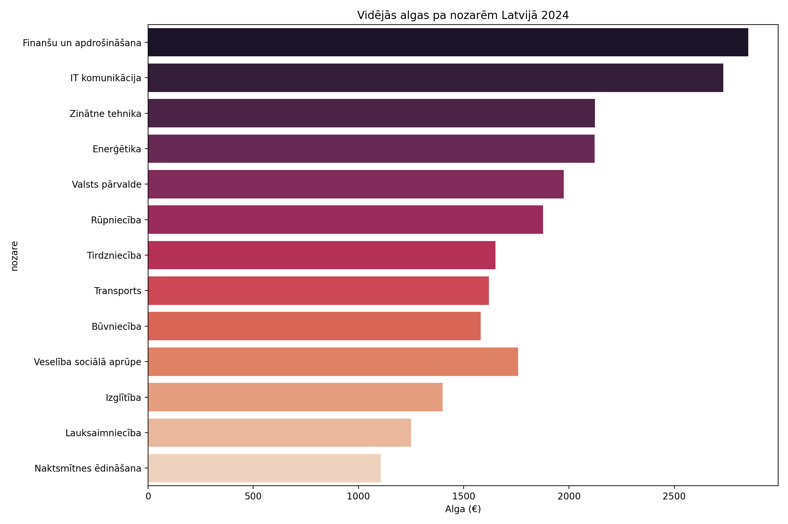
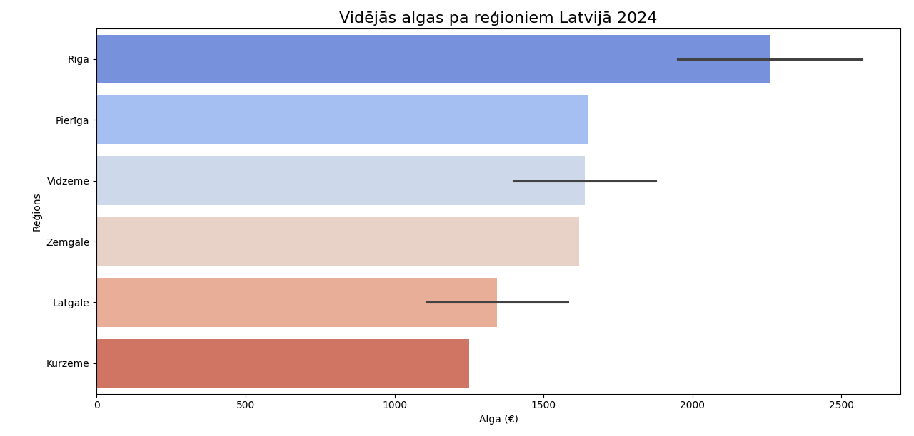

# Latvijas algas 2024

Oficiālie Centrālās statistikas pārvaldes (CSP) dati – 2024. gada 2. ceturksnis

### Galvenie secinājumi
- Vidējā bruto alga Latvijā: **1850 €**
- 1. vieta: **Finanšu un apdrošināšana** – 2851 €
- 2. vieta: **IT un komunikācija** – 2733 €
- Zemākā nozare: **Naktsmītnes un ēdināšana** – 1107 €

### Grafiki

**Algas pa nozarēm**  

**Algas pa reģioniem**  

**Tehnoloģijas**  
Python • Pandas • Seaborn • Matplotlib  

**Datu avots**  
[CSP oficiālie dati 2024](https://data.stat.gov.lv/...)
